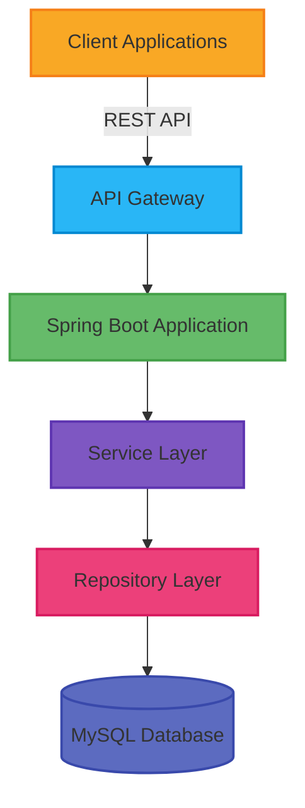
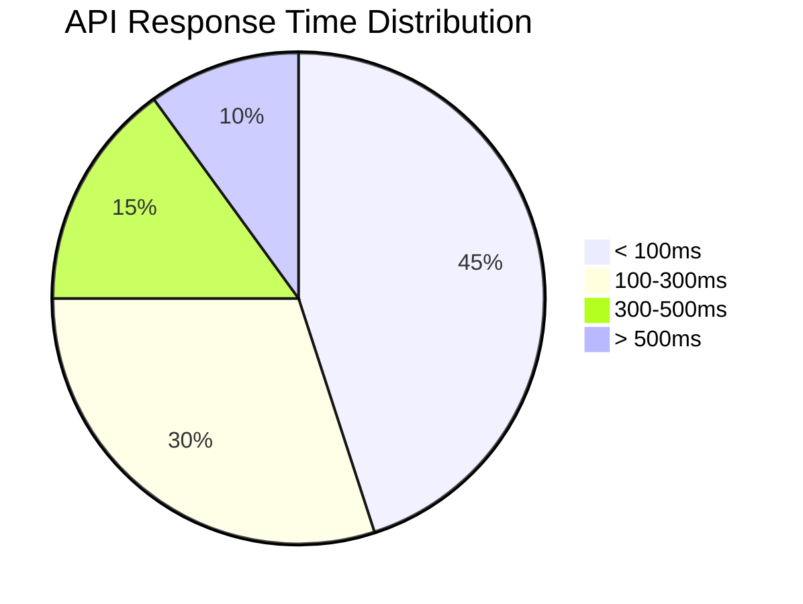
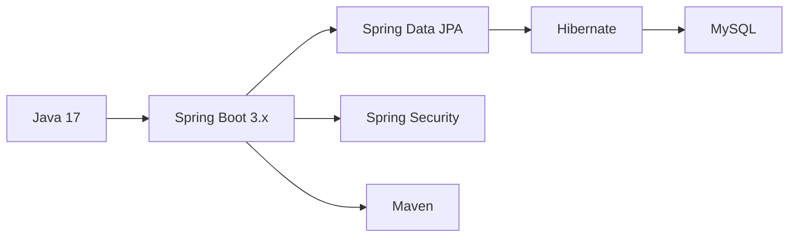
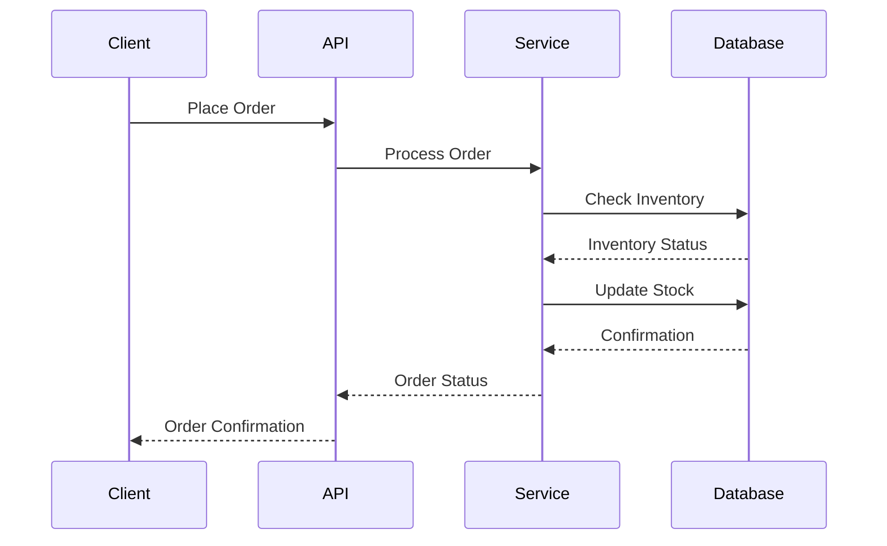
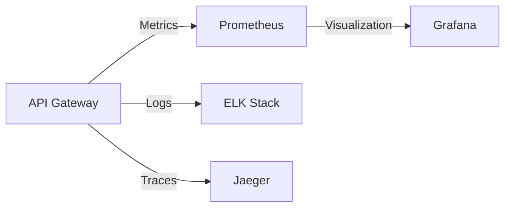
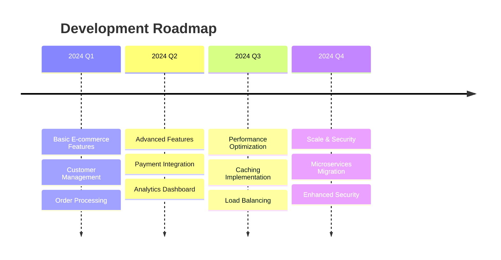

# 🛍️ Spring Boot E-Commerce Core API

<div align="center">

[](https://www.oracle.com/java/)
[](https://spring.io/projects/spring-boot)
[](https://www.mysql.com/)
[](LICENSE)

[Features](#features) • [Installation](#installation) • [API Reference](#api-reference) • [Documentation](#documentation) • [Contributing](#contributing)

</div>

A modern, scalable e-commerce backend API built with Spring Boot, featuring comprehensive order management, customer tracking, and inventory control.

## 📊 System Architecture



## 📈 Performance Metrics



## ✨ Features

<div align="center">

| Feature | Description | Status |
|---------|-------------|---------|
| 👥 **Customer Management** | Profile tracking & preferences | ✅ |
| 📦 **Inventory Control** | Real-time stock management | ✅ |
| 🛒 **Order Processing** | Complete order lifecycle | ✅ |
| 🔐 **Security** | JWT Authentication & Authorization | ✅ |
| 📊 **Analytics** | Sales & inventory insights | 🚧 |
| 💳 **Payment Gateway** | Secure payment processing | 🚧 |

</div>

[Previous content remains the same until Tech Stack section]

## 🛠️ Tech Stack

<div align="center">



</div>

[Previous installation & setup content remains the same]

## 📊 API Performance

```mermaid
gantt
    title API Response Times
    dateFormat  X
    axisFormat %s
    
    section Customer API
    GET All    :0, 150ms
    POST New   :0, 200ms
    UPDATE     :0, 180ms
    
    section Order API
    Create Order :0, 300ms
    Get Status  :0, 100ms
    
    section Inventory API
    Stock Check :0, 120ms
    Update      :0, 250ms
```



## 🔄 Business Flow



[Previous API Endpoints content remains the same]

## 📈 System Monitoring



## 🌟 Feature Roadmap



[Previous content remains the same until Authors section]

## 👥 Authors

<div align="center">

[](https://github.com/ChamathDilshanC)
[](https://www.linkedin.com/in/chamathdilsahnc/)
[](mailto:dilshancolonne123@gmail.com)

</div>

## 📊 Project Statistics

<div align="center">


</div>

---

<div align="center">

Made with ❤️ by [Chamath Dilshan](https://github.com/ChamathDilshanC)

⭐ Star this repository if you find it helpful!

</div>

## ✨ Features

- **Customer Management**: Track and manage customer profiles and preferences
- **Inventory Control**: Real-time stock management and updates
- **Order Processing**: Complete order lifecycle management with transaction support
- **RESTful API**: Modern API design following REST principles
- **Security**: Robust authentication and authorization (customizable)
- **Database**: JPA/Hibernate with transaction management
- **Documentation**: Swagger/OpenAPI integration

## 🚀 Tech Stack

- **Java 17**
- **Spring Boot 3.x**
- **Spring Data JPA**
- **MySQL Database**
- **Maven**
- **Hibernate**

## 📋 Prerequisites

- JDK 17 or later
- Maven 3.6+
- MySQL 8.0+
- Your favorite IDE (IntelliJ IDEA recommended)

## 🛠️ Installation & Setup

1. **Clone the repository**
   ```bash
   git clone https://github.com/yourusername/spring-boot-ecommerce.git
   cd spring-boot-ecommerce
   ```

2. **Configure MySQL**
   ```properties
   # Update application.properties
   spring.datasource.url=jdbc:mysql://localhost:3306/ecommerce_db
   spring.datasource.username=your_username
   spring.datasource.password=your_password
   ```

3. **Build the project**
   ```bash
   mvn clean install
   ```

4. **Run the application**
   ```bash
   mvn spring-boot:run
   ```

## 🌐 API Endpoints

### Customer Management
```
GET    /api/v1/customer     - Get all customers
POST   /api/v1/customer     - Create new customer
PUT    /api/v1/customer     - Update customer
DELETE /api/v1/customer/{id} - Delete customer
```

### Inventory Management
```
GET    /api/v1/item        - Get all items
POST   /api/v1/item        - Add new item
PUT    /api/v1/item        - Update item
DELETE /api/v1/item/{code} - Delete item
```

### Order Management
```
POST   /api/v1/order/save  - Create new order
```

## 📦 Sample Request Objects

### Create Order
```json
{
  "orderId": "ORD001",
  "orderDate": "2024-02-15T14:30:00",
  "customerId": "C001",
  "orderDetails": [
    {
      "itemCode": "ITM001",
      "quantity": 2,
      "unitPrice": 1500.00
    }
  ],
  "total": 3000.00
}
```

## 🛡️ Security Configuration

Basic configuration is included but should be customized for production:

```java
@Configuration
@EnableWebSecurity
public class SecurityConfig {
    // Add your security configuration here
}
```

## 📊 Database Schema

### Core Tables
- `customer` - Customer information
- `item` - Product inventory
- `orders` - Order headers
- `order_detail` - Order line items

## 🔧 Project Structure

```
src/
├── main/
│   ├── java/
│   │   └── lk.ijse.spring_boot/
│   │       ├── controller/
│   │       ├── dto/
│   │       ├── entity/
│   │       ├── repo/
│   │       ├── service/
│   │       └── Application.java
│   └── resources/
│       └── application.properties
└── test/
    └── java/
```

## ⚙️ Configuration

Key application properties:

```properties
# Server Configuration
server.port=8080
server.servlet.context-path=/api

# Database Configuration
spring.jpa.hibernate.ddl-auto=update
spring.jpa.show-sql=true

# Swagger/OpenAPI
springdoc.api-docs.path=/api-docs
```

## 🧪 Testing

Run tests using Maven:

```bash
mvn test
```

## 📈 Future Improvements

- [ ] Add payment gateway integration
- [ ] Implement caching
- [ ] Add event-driven architecture
- [ ] Implement rate limiting
- [ ] Add metrics and monitoring
- [ ] Containerize with Docker

## 🤝 Contributing

1. Fork the project
2. Create your feature branch
3. Commit your changes
4. Push to the branch
5. Open a Pull Request

## 📝 License

This project is licensed under the MIT License - see the [LICENSE.md](LICENSE.md) file for details.

## 👥 Authors

- **Chamath Dilshan** - *Initial work* - [My Github ❤️](https://github.com/ChamathDilshanC)

## 🙏 Acknowledgments

- Spring Boot team for the amazing framework
- The open-source community

## 📧 Contact

- Email: dilshancolonne123@gmail.com.com
- LinkedIn: [My Linkedin ❤️](https://www.linkedin.com/in/chamathdilsahnc/)
